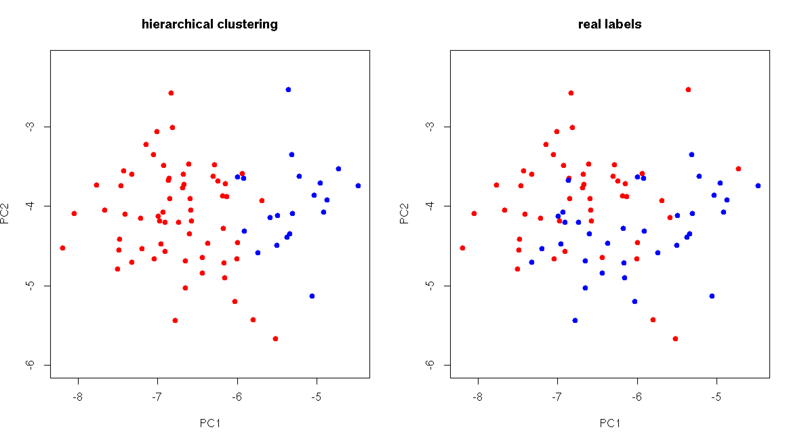

# CCLE-Analysis

<p align="center">
    
    
</p>

|**Languages** | **Libraries** |
| -----| ---- |
| |    <br />     

<a name="description"/>

## Description
Here the results of a statistical analysis of breast cancer data are presented. Relevant datasets for the project can be found through the [Cancer Cell Line Encyclopedia (CCLE)](https://depmap.org/portal/download/) database. 

The CCLE is a multi-institutional effort to develop a comprehensive database for varying types of cancer. 

All relevant statistical undertakings in this project are categorized under different project folders with respect to their scope and or data. 


<a name="motivation"/>

## Motivation
The goal of this project is to understand the link between the genetic and physiological data of a patient and how efficiently cancer-treating drugs perform on their cells.  Unsupervised methods such as hierarchical or k-means clustering may allow for an undestanding of hidden structure in the data, and regression analysis could help us quantitatively predict how well a drug will perform on an individual given their gene sequencing data. 

To simplify the project scope, the analysis is strictly limited to patients having breast cancer, as opposed to all cancers which were present in the main dataset. 

<a name="requirements"/>

## Requirements 
The project itself uses the following files from the CCLE database:
- *data_clinical_patient.txt*
- *data_clinical_sample.txt*
- *data_drug_treatment_auc.txt*
- *data_mrna_seq_rpkm.txt*
For seamless integration with the existing code, download and save these files in a directory denoted `Dataset` stored in the root. 

On the R side, loading the project in R Studio should prompt to load any missing packages you have.  For the Python-dependent code (used mainly for exploratory purposes) simply pip install from `requirements.txt` as such:
```
pip install -r requirements.txt
```
A collection of utilities and preprocessing scripts are included in the utilities folder of the project. 


<a name="results"/>

## Results 
*Note:* in the following section the terms "AUC" or "AUC score" are equivalent to "drug efficacy". 
### Hierarchical Classification 
<p align="center">
    
</p>

One vein of analysis was to consider the clusters arising from applying heirarchical clustering (euclidean distance, single linkage) to a reduced dataset containing only two cancers which in theory should be quite different in their manifestation.  We prove the merit of this approach using samples corresponding to breast and central nervous system cancers. 

4 classifiers were trained by changing 2 parameters; sparsity of the drug data, and projection of data along first *n* principle components which accounted for 90% of the variance. In the most refined case (PC projection and reduced drug data) the labels generated by the unsupervised model agreed with the real labels with an **accuracy of 74%**. 

### Drug Response AOV 
<p align="center">
    
    
</p>

Given the heterogeneous nature of the dataset (many data sources, high sparsity) it was crucial to investigate the influence of categorical variables which described inherent differences in each data sample.  This list includes: `Sex`, `Ethnicity`, `Cell Line Source`, `Age`. 

After verifying the necessary assumptions required to implement aov - namely normality and homoscedasticity - we analyzed the influence of the aforementioned variables on the drug performance across cells. 

It was found that for a confidence level of 10% the variable `Cell Line Source` does indeed influence the susceptibility of the cell to treatment.  For confidence levels below 8% we cannot reject the null hypothesis, however. This means that lab from which the cell was obtained is related to the auc score of this cell.  

When considering `Ethnicity`, we also find that there is an influence on the auc score at a confidence level of >3%. 

One should be wary of these results however, since the dataset is quite small and not balanced. 

### AUC Regression 
<p align="center">
    
</p>

The main effort of this project was to predict the auc score on a given cell using the genetic and physiological information of the patient.  Before such analysis could be undertaken, however, it was necessary to reduce the dimensionality of the feature space since over 50000 gene expressions were included in the provided dataset. To do this, a LASSO regression model was implemented and the genes corresponding to the non-zero coefficients were retained. 

This gene pool was cross-refernced with the outcome of similar efforts in dimensionality reduction using random forests, and the intersection of the chosen genes from each method was kept.  After this, exhaustive search was applied to the reduced gene pool to find the best selection of regressors for models with *p=1...n*-dimensional feature spaces. The identified genes were researched to see whether or not they have been previously identified as being influential in breast cancer expression.  In the end, the feature space was reduced to 8 significant genes (our regressors). 

<p align="center">
    
</p>

To account for the limited number of samples present in the cleaned dataset (removal of NA's and non-relevant cancer-treating drugs) k-fold cross validation was used.  The (k=5) cross-validated R^2 values during the training phase for each fold were: 0.746, 0.770, 0.758, 0.745, and 0.786.

Since the auc score is a number in the range [0,1], it would have been more apt to use a logistic regression model on our data, but such multi-dimensional infrastructure did not exist in any R libraries the practitioner could find.  
